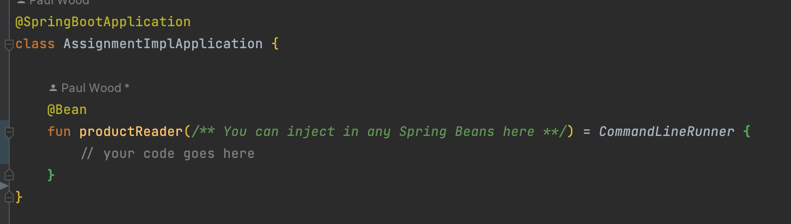

# Kotlin Coding Assignment

Congrats on completing the Kotlin training, now you must put everything you have
learnt all together to complete the following Springboot assignment. This
assignment must be completed individually but you are welcome to ask for help
from your trainers if you get stuck via email. \
You will be expected to deliver your completed assignment and explain your approach
in an upcoming session. Try your best and good luck and have `fun`.

## Unit tests

To split your work up in into smaller tasks and get feedback on your progress,
you can write unit tests. It is recommended to write a test before you start
implementing the functionality. The added benefit compared to manual tests is
that you also write assertions for the expected behaviour. This way you can be
sure that your code works as expected. You can rerun tests to verify that your
code still works after you made changes.

#### Testing with a Repository and MockK

It is advised to write unit tests to ensure that your application is working as
expected. However, spinning up a mongo database for tests is not always a good
idea, so instead to make your tests quicker and easier to follow, you should
mock the behaviour of a database in a Unit test. \
If you find yourself struggling to mock an interface with MockK using the annotations
`@MockK` or `@RelaxedMock` you can use the following code snippet in your test files instead.

```kotlin
private val \** Your repository name & Type **\ = mockk()
``` 

This will create a mock of your repository interfaces.

## Part 1: Products

You have been asked to create an Order API for a grocery store, luckily your
product owners were able to acquire a skeleton Springboot application with
everything you will need to get started. In the following project you will find
an empty SpringApplication with the `main` function located in the
`AssignmentApplication.kt` Kotlin file. \
You will also notice that you have all the necessary `mvn` dependencies for you to
create a webApplication including an in-memory Mongo DB.

Your role is to create an API which will allow a user to make an Order for an
online grocery store. In order to complete this you will need to create two
APIs', one to retrieve a list of Products stored in a Mongo DB, and one to
create and manage Orders. \
Your first task will be to read in the Product list provided to you in the `src/main/resources/products.json`
file. This is a JSON file with 102 Products, these products need to be loaded into
the Mongo DB as soon as the application starts, unless of-course they are already
stored in the DB.

## Task 1: The Products API

In this task you will go through all the steps needed to create the Product API,
be sure to have a working implementation of each task before moving on to the
next. It is also highly recommended to write both Unit and Integration test for
each of your tasks.

### Task 1A: Reading in the JSON file

In the `src/main/resources/` you will find a `products.json` file, in it you
will see a JSON array populated with multiple products. Each product has the
following JSON structure

```text
{
  "id": UUID,
  "name": String,
  "imageUrl": String,
  "price": Double
}
```
You will need to read in the above-mentioned JSON file and convert the JSON array into 
Kotlin Objects, for this you must make use of a `jacksonObjectMapper()` and your class 
signature will have to match the JSON structure exactly.

***Hint***: In order to perform an action on application startup you can use a Spring 
`CommandLineRunner` Bean like follows:




### Task1B: Storing the Products in Mongo

Once you have converted the JSON array into simple objects you will need to
store these objects in Mongo, for this you will need a Spring Repository. You
should store the objects in your repository as soon as the application starts.

> NB! Make sure that you mark the UUID in your Mongo Document with the 
> `@ID` annotation, or you will infinitely populate your DB

### Task1C: Create an API to retrieve all

Now that you have some products stored in a DB you will have to create an API
for your website to fetch all the products. For this to work you will need to
add a controller which exposed the following `GET` endpoint:

> GET http://localhost:8082/products

This should return a list of all the products that you have stored in your
database.

```text
{
  "id": UUID,
  "name": String,
  "imageUrl": String,
  "price": Double,
  "quantity": Int
}
```

Therefore the above URL endpoint should return something like this:

```json
[
  {
    "id": "798bfd69-ab23-4d0e-9766-bb2f5c4c7d05",
    "name": "bread",
    "imageUrl": "/bread.jpg",
    "price": 5.99,
    "quantity": 0
  },
  {
    "id": "d9f6241b-4fb2-4e35-afcc-5d1f7dd23e11",
    "name": "milk",
    "imageUrl": "/milk.jpg",
    "price": 3.49,
    "quantity": 10
  }
  // etc etc
]
```

If you now run the application and go to a browser you should be able to see the 
above JSON at the following URL: [http://localhost:8082/products](http://localhost:8082/products)

### Task1D: Create an API to retrieve a single product

Now that you have an API to retrieve all the products, you will need to create
an API to retrieve a single product. The URL should look like this:

> GET http://localhost:8082/products?id=798bfd69-ab23-4d0e-9766-bb2f5c4c7d05

**Hint** you will need to add a `params` array to one of the two endpoints in the
controller to avoid the endpoints conflicting. The params array will include all of the 
`RequestParameters` in the endpoint and will look something like this.

```kotlin
@GetMapping(params = ["id"], produces = [MediaType.APPLICATION_JSON_VALUE])`
```

This API allows the user to retrieve a single product by its ID, if no product 
exists with the passed in ID you should return `NULL`. 

Going to the following URL in your browser should now show you the JSON object for 
Bread: [http://localhost:8082/products](http://localhost:8082/products?id=798bfd69-ab23-4d0e-9766-bb2f5c4c7d05)


```json
{
    "id": "798bfd69-ab23-4d0e-9766-bb2f5c4c7d05",
    "name": "bread",
    "imageUrl": "/bread.jpg",
    "price": 5.99,
    "quantity": 5
}
```

### Bonus exercise 1: 

Add error handling for missing products, instead of returning `NULL`. Add an 
exception message with the response code 404: "No Product found with id: $id". 
The expected error response would look something like this:

```text
HTTP/1.1 404 
Content-Type: text/plain;charset=UTF-8
Content-Length: 62
Date: Sat, 08 Apr 2023 21:18:22 GMT
Keep-Alive: timeout=60
Connection: keep-alive

No product found with id: 798bfd69-ab23-4d0e-9766-bb2f5c4c7d04
```

## Task 2: Orders

Now that the API exposes a list of products, it's time to allow the user to
create an Order. And Order must be validated before it can be stored.

### Task 2A: Create an Order (Happy flow)

Create a new Post endpoint which will allow a user to create an order, an order
may contain a list of multiple products. Each order item must contain an id of the
product that was ordered as well as a quantity.

An order create request has the following url:

> POST http://localhost:8082/orders

The request body should look like this:

```json
{
  "items": [
    {
      "id": "798bfd69-ab23-4d0e-9766-bb2f5c4c7d05",
      "quantity": 1
    }
  ]
}
```

The order will be successful if: 

* All order item IDs are found in the products table.
* The quantity of each item in the order is less than or equal to its respective product quantity.
* The quantity specified is NOT negative

For now return null if any of the conditions above failed. A successful order should return a 200 
status code and the order should be stored in the database. 
The endpoint should also return the following body in the event of a successful order created:

```json
{
  "totalItems": 13,
  "totalPrice": 23.88
}
```

Where `totalItems` is the sum of all the `quantity` items in the order, and `totalPrice` is the 
sum of each product multiplied by its price. 

For example, the following CURL command:

```text
curl -X POST \
  http://localhost:8082/orders \
  -H 'Content-Type: application/json' \
  -d '{
  "items": [
    {
      "id": "d9f6241b-4fb2-4e35-afcc-5d1f7dd23e11",
      "quantity": 3
    },
    {
      "id": "54e9c0f2-9565-4aeb-8a5f-77998d7dc12f",
      "quantity": 2
    }
  ]
}'

```
Would send back the following JSON response: (The command summed up 3 milks with 2 shrimps)
```json
{
  "totalItems": 5,
  "totalPrice": 28.45
}
```

**Decreasing the quantity of the product**

For every line item in the order the quantity field of the Product should be
decreased. If there are 10 breads in stock and you order 2, there should only be
8 breads in stock after the order was successfully placed.

You can verify whether this works by retrieving the product information again and viewing it in
a browser.

### Task 2B: Error cases

The API should give an error if:

- an item could not be found in the database
- there is not enough stock to fulfill the order
- the quantity is less than 1

You can return an appropriate error message for each type. Hint: Lookup HTTP Status 400 error 
codes

## Task 3: Bonus

Instead of giving an error when there is not enough stock, you can allow the
user to order partial quantities. For example, if there are 10 breads in stock
and the user orders 20, the order should be fulfilled with 10 breads.

For a request that looks like this:

```json
{
  "items": [
    {
      "id": "798bfd69-ab23-4d0e-9766-bb2f5c4c7d05",
      "quantity": 20
    }
  ]
}
```

The API can return a 206 (Partial Content) status code and a response body that
looks like this:

```json
{
  "id": "0d26366b-d684-413a-830b-2832752bfb52",
  "items": [
    {
      "id": "798bfd69-ab23-4d0e-9766-bb2f5c4c7d05",
      "quantity": 10
    }
  ]
}
```

Note there is an `id` field in the response body. This is the id of the order as
it is stored in the database.

The quantity in the response body is smaller than the quantity in the request.
